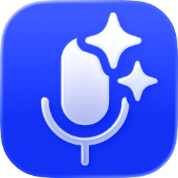

# Speech

On-device speech to text for macOS. Speech transcribes the microphone as you speak and transcribes audio and video recordings, with a choice of speech models that all run on your Mac: Apple's own speech recognition built into macOS, and open models run by FluidAudio (Core ML), transcribe.cpp (ggml) and MLX.

Speech is an OMC/ActionUI shell applet around the [`speech`](https://github.com/abra-code/speech) command-line tool, which does the transcribing, downloads the models and measures them.

Built with **OMC** engine - [github.com/abra-code/OMC](https://github.com/abra-code/OMC/)  
UI rendered by **ActionUI** - [github.com/abra-code/ActionUI](https://github.com/abra-code/ActionUI/)

## Features

- **Live** - transcribes the microphone as you speak. The words still being spoken are shown as a draft and settle as each sentence ends. Stop keeps the transcript; export it or copy it.
- **Recordings** - a list of audio and video files, transcribed one after another. Drop files onto the window or the app, use File > Open..., "Open With" in Finder, or the "Transcribe with Speech" service, or press Record to capture a new recording into `~/Documents/Speech Recordings`. Each transcript is saved beside its recording as `<name> - <model id>.txt`, so one recording transcribed with several models keeps every transcript. An existing transcript is replaced only when Speech wrote it and neither it nor the recording has changed since; otherwise it is left alone and the Status column says why. The selected recording plays in the pane above its transcript, and the arrows reorder the list: with Join Transcripts on, Export and Copy give one transcript for the whole list, in list order, with the timings carried across.
- **Export** - plain text, SRT and WebVTT subtitles, or JSON with word and segment timings.
- **Transcript text size** - a size picker on both the Live and Recordings tabs, from 13 to 64 pt.
- **Models** (Models > Manage Models...) - every model the `speech` catalog can transcribe with, grouped as built into macOS, downloaded, and available to download. Downloads keep going after the window is closed and resume after the app quits. A model is never deleted while it is downloading or transcribing. Add Model... adds a transcribe.cpp (ggml) model from Hugging Face that the list does not include: Speech downloads it, checks that it can transcribe with it, and lists it with the rest. The information button shows a model's details and its family's page, with reference measurements taken on one test Mac. Best for names the model to use for recordings and for Live in the language you pick, taken from the measurements rather than from a formula; a language nothing has been measured in says so rather than guessing. The catalog's helper rows, which transcribe nothing on their own, are left out.
- **Benchmarks** - measures models on this Mac, because a published measurement belongs to the Mac it was taken on. Pick a corpus of standard test recordings ([FLEURS](https://huggingface.co/datasets/google/fleurs/tree/main/data) in 102 languages, [LibriSpeech](https://openslr.org/12/) in English; Download fetches one), a quick sample of 100 recordings or the full set, and add models to the queue. One measurement runs at a time, so they do not compete for the same memory and Neural Engine, and the queue survives quitting. The table gives error rate, character error rate, speed and peak memory, with this Mac's rows above the reference rows from the test Mac. Measuring on your own recordings arrives in a later update.

## Recordings it can read

Anything macOS itself decodes, video included, since Speech takes the audio track. Every recording is decoded once to 16 kHz mono before any model sees it, so a stereo 48 kHz file and a mono 16 kHz file of the same take are transcribed from the same audio; a file with several audio tracks has them mixed together.

| | Formats |
| --- | --- |
| Audio | WAV, AIFF, CAF, MP3, M4A and AAC, Apple Lossless, FLAC |
| Video | MOV, MP4, M4V, and other containers QuickTime opens |
| Not read | WebM, Matroska (MKV), Ogg, Opus, WMA, AMR - Speech says so rather than half-transcribing them. Convert to WAV or M4A first. |

## Models and engines

In the model pickers and the Models window, a downloaded model's name ends with a mark for its engine. Apple's built-in models have no mark; their names already say Apple.

| Mark | Engine | Runs on | Models |
| --- | --- | --- | --- |
| none | Apple Speech (SpeechAnalyzer) | Neural Engine, part of macOS 26 | Apple's long-form transcriber and its dictation engine |
| squared F | FluidAudio | Core ML on the Neural Engine | Parakeet, Parakeet Unified, Nemotron, Canary |
| squared G | transcribe.cpp | ggml on the GPU | Whisper, Parakeet, Parakeet Unified, Canary, Qwen3-ASR, Granite Speech, Nemotron |
| squared M | MLX | MLX on the GPU | Parakeet, Whisper, Qwen3-ASR |

Which model is best depends on the language, the kind of recording and the Mac. The `speech` repository publishes one battery of measurements across six languages in [docs/benchmarks](https://github.com/abra-code/speech/blob/main/docs/benchmarks/README.md); treat them as a starting point, not a verdict for your Mac.

## On-device by design

Transcription runs entirely on this Mac; recordings and transcripts never leave it. The network is used for two things only:

- **Model downloads** - open models come from Hugging Face when you download or add them in the Models window.
- **Apple's language files** - the first time an Apple engine transcribes in a language, macOS may download that language's speech files. Speech shows the language and the time spent; on a slow or metered connection macOS can hold the download back, and the status says so. macOS keeps a limited number of languages for each app, so adding one can release another, which then downloads again when it is next used.

Neither Apple engine needs Siri or keyboard dictation turned on in System Settings.

## Building

The runtime pieces under `Contents/Support` and `Contents/Resources/Reference` are git-excluded, assembled by `update_speech.sh` from sibling checkouts:

- `speech`, `CTranscribe.framework` (transcribe.cpp, loaded from beside the binary), the built-in model catalog `speech-catalog/`, the optional MLX helper `speech-mlx`, and the notices that travel with them - built from the [`speech`](https://github.com/abra-code/speech) repository (Apache 2.0) with its own `build.sh`.
- `fingerprint` - from the [`replay`](https://github.com/abra-code/replay) repository (MIT), its universal release build. Speech uses it to tell a transcript it saved, untouched since, from one it must not replace.
- `Resources/Reference/` - the published measurements and the model pages from the `speech` repository (`docs/models-user`). The info sheet shows `Reference/models/<model id>.md` when there is one, otherwise `Reference/models/<family>.md`, which is how Apple's two engines get a page each while a family's variants share one.

The script refuses to sign a bundle whose binaries lack their notices, thins every Mach-O to arm64, deep-signs the bundle and checks that the tools launch. Run `./update_speech.sh` (see `--help` for `--skip-build`, `--without-mlx`, `--speech-repo`, `--replay-repo`, `--identity`, `--no-codesign`).

## Testing

`Tests/*.test.sh` run the real handlers against a mock OMC environment with AppletBuilder's `appletbuilder test Speech.app`. A fake `speech` (`Tests/helpers/fake-speech.sh`) answers from fixtures, so no model loads and no microphone opens; the bundle must be assembled first, since the bundled `fingerprint` runs for real.

## Layout

- `Speech.app/Contents/Resources/Scripts/` - the OMC command handlers and shared libraries (`lib.speech.sh`, `lib.speech.models.sh`), and the jq programs that read `speech`'s JSON (`speech.catalog.jq`, `speech.events.jq`, `speech.models.jq`, `speech.download.jq`). POSIX `/bin/sh` (macOS bash 3.2); validate with `sh -n`.
- `Speech.app/Contents/Resources/Base.lproj/` - the ActionUI windows: the main window, the Models window and its information sheet, and the menu.
- `Speech.app/Contents/Resources/Command.json` - OMC command definitions.
- `Speech.app/Contents/Resources/languages.tsv` - language names for the language pickers.
- Application support at runtime: `~/Library/Application Support/Speech/` (`Models/`, `Catalog/`, `Downloads/`, `Adding/`, `Sessions/`, `Settings/`, and for the Benchmarks tab `Corpora/`, `CorpusDownloads/` and `Benchmarks/`).

## Requirements

- An Apple Silicon Mac running macOS 15 or later.
- macOS 26 or later for Apple's built-in engines; on macOS 15 the downloaded models do the transcribing.
- Microphone access for Live and Record.

## License

Apache-2.0. See [LICENSE](LICENSE). The bundled `speech` and its components carry their own notices in `Contents/Support`; `fingerprint` is MIT licensed.
